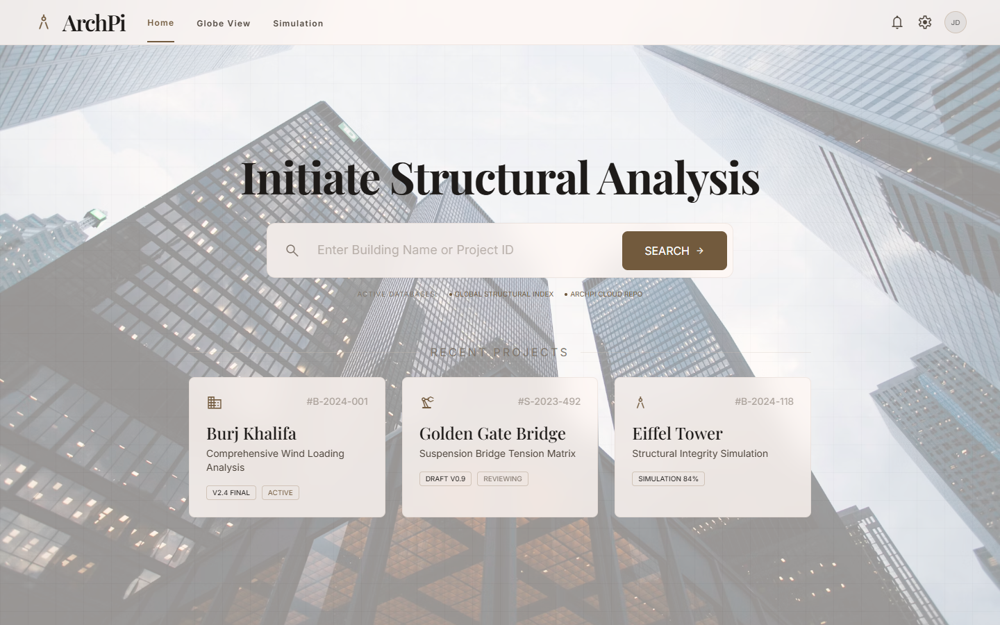
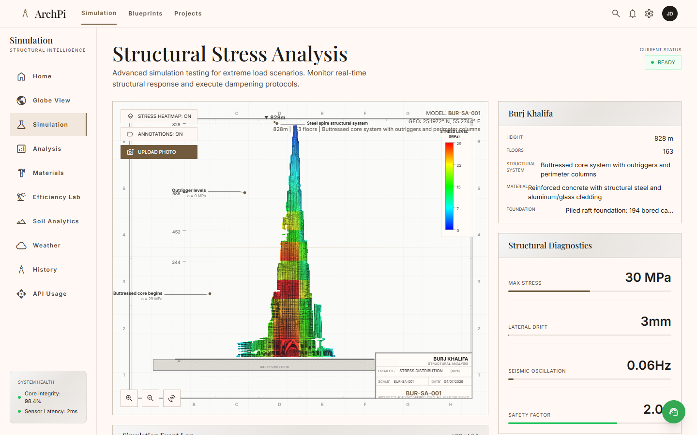
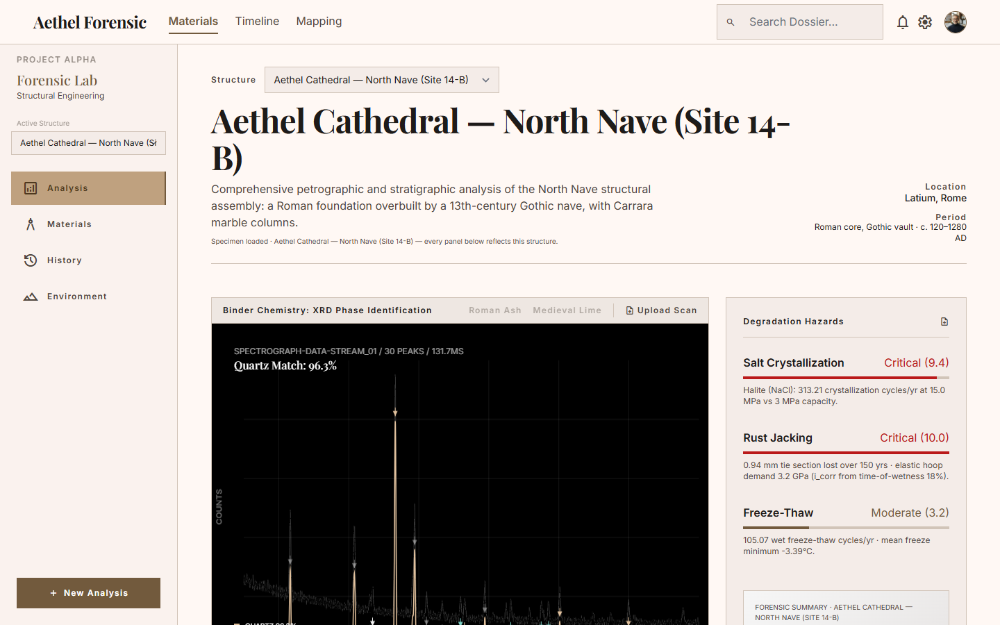
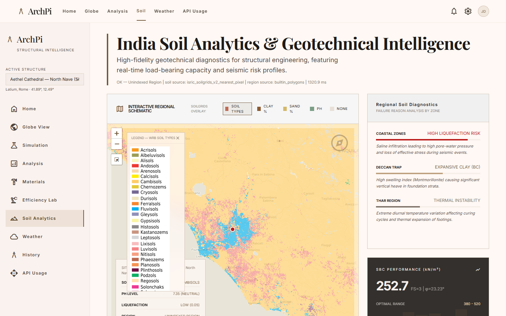
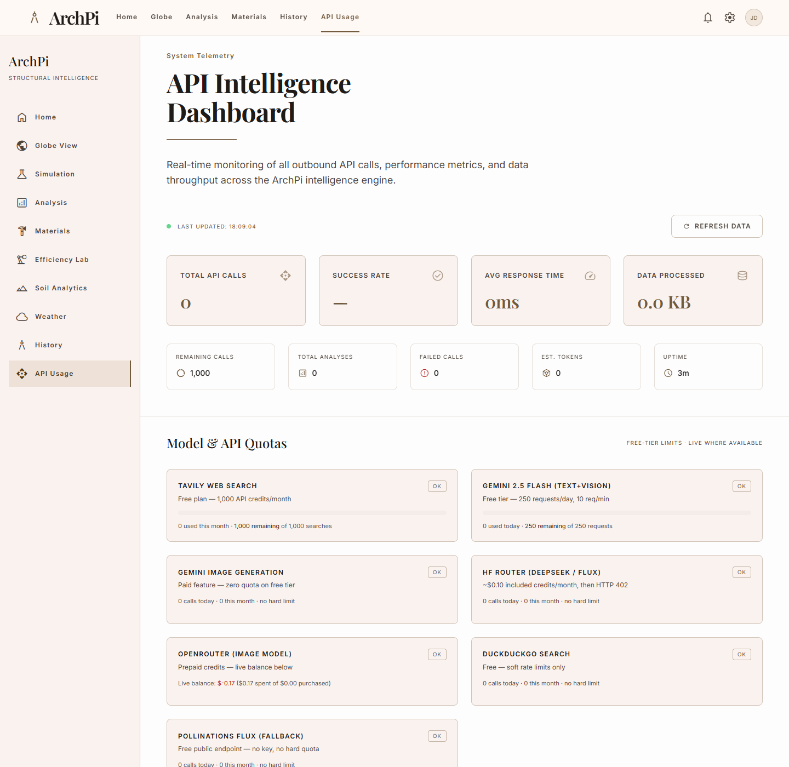

# ArchPi — Architectural Engineering Diagnostic Hub

An AI-powered structural-engineering research and diagnostics platform. Type any building on Earth and ArchPi researches it live on the web, extracts a structured engineering dossier with an LLM, generates a CAD-style elevation drawing, runs a real finite-element stress simulation on it, and cross-references soil, weather, and forensic material data — all on free-tier APIs with multi-provider fallback chains.



## Features

| Page | What it does |
|---|---|
| **Analysis** | Autonomous deep research: 5 Tavily + 3 DuckDuckGo searches, LLM knowledge & reasoning passes, streamed live over SSE with the agent's reasoning visible, then synthesized into a structured dossier (materials, timeline, specs, blueprint) with images attached per section |
| **Simulation** | Real 2D frame FEA (direct stiffness method, NumPy) — seismic / wind / load cases on a per-building structural profile generated by the LLM; results interpreted by DeepSeek into an engineer's event log, streamed over WebSocket. V&V suite matches cantilever beam theory to machine precision |
| **Photo upload** | Gemini Vision identifies any photographed structure, estimates its silhouette profile, then a FLUX pipeline (OpenRouter → HF router → Pollinations) redraws it as an orthographic elevation for the FEA heatmap |
| **Soil Analytics** | Live ISRIC SoilGrids + Supabase PostGIS point-in-polygon region lookup → Terzaghi safe bearing capacity, liquefaction index, seismic zone |
| **Weather** | Open-Meteo live + 30-year ERA5 normals → wind shear, carbonation risk, thermal loading per structure; global stress vectors |
| **Forensic Lab** | Synthetic-data materials forensics: XRD phase ID (Rietveld-style peak matching), radiocarbon calibration, dendrochronology, isotope provenance, salt/rust/freeze-thaw hazard engines, Harris-matrix stratigraphy — 119 pytest tests |
| **API Usage** | Live quota dashboard: per-provider used/remaining against free-tier limits, live OpenRouter credit balance, Supabase storage gauge with per-table breakdown, persisted call history |






## Architecture

```
                        ┌─────────────────────────────┐
 Browser (11 pages) ───►│  Node/Express  :3000        │
   SSE + WebSocket      │  server.js                  │
                        │  • research orchestrator    │
                        │  • FEA engine (python sub)  │──► fea_engine.py (NumPy stiffness matrix)
                        │  • image pipeline + proxy   │──► image/sketch/search agents (DDG, Wikipedia)
                        └──────┬──────────────────────┘
                               │
        ┌──────────────────────┼───────────────────────────┐
        ▼                      ▼                            ▼
┌───────────────┐   ┌────────────────────┐   ┌─────────────────────────┐
│ Flask :5001   │   │ FastAPI :8000      │   │ FastAPI :8010           │
│ LangChain     │   │ soil_backend       │   │ forensic_backend        │
│ agent —       │   │ ISRIC SoilGrids    │   │ XRD · ¹⁴C · dendro ·    │
│ extract/      │   │ Open-Meteo         │   │ isotopes · hazards ·    │
│ knowledge/    │   │ Supabase PostGIS   │   │ stratigraphy (NumPy/    │
│ reason        │   │ (Terzaghi SBC)     │   │ SciPy/NetworkX)         │
└───────┬───────┘   └────────────────────┘   └─────────────────────────┘
        ▼
  LLM fallback chain: DeepSeek-V3.2 (HF router) → Llama-3.3-70B → Gemini 2.5 Flash → Flash-Lite
  Image chain:        OpenRouter → HF FLUX.1-dev → Pollinations (free)
```

Design principles:

- **Deterministic math is cordoned off from the LLM.** The FEA engine only computes; the LLM only reads its output afterwards and narrates. No calculation is ever delegated to a model.
- **Every external dependency has a fallback.** LLM, image generation, search, and region lookup each degrade through 2–4 providers down to a free or built-in path, so the app keeps working when quotas run out.
- **Everything observable.** All outbound API calls are logged, persisted, and shown against their real free-tier limits on the usage dashboard.

## Running it

Requirements: Node 18+, Python 3.12+, `pip install -r app/requirements.txt`, `cd app && npm install`.

Create `app/.env` (never commit it):

```
HUGGINGFACEHUB_API_TOKEN=hf_...
TAVILY_API_KEY=tvly-...
GEMINI_API_KEY=...
OPENROUTER_API_KEY=sk-or-...          # optional
OPENROUTER_IMAGE_MODEL=google/gemini-3.1-flash-lite-image
DATABASE_URL=postgresql://...supabase.co:5432/postgres   # optional (PostGIS)
```

Start the four services from `app/`:

```bash
npm run dev                                            # main server  :3000
python langchain_agent.py                              # LLM agent    :5001
python -m uvicorn soil_backend.main:app --port 8000    # soil         :8000
python -m uvicorn forensic_backend.main:app --port 8010 # forensic    :8010
```

Open http://localhost:3000. Tests: `cd app && pytest tests/ -q` (119 tests).

## Repo layout

```
app/
  server.js            Express server: research, FEA orchestration, image pipeline
  fea_engine.py        Direct-stiffness FEA solver + V&V suite
  langchain_agent.py   Flask LLM agent (extract / knowledge / reason)
  *_agent.py           DuckDuckGo / Wikipedia / Tavily image & search agents
  soil_backend/        FastAPI geotechnical service (SoilGrids, Open-Meteo, PostGIS)
  forensic_backend/    FastAPI forensic materials lab (XRD, ¹⁴C, dendro, hazards…)
  public/              11-page frontend (Tailwind, Leaflet, vanilla JS)
  tests/               pytest suite for the forensic engines
ui_designs*/           Design-source mockups the pages were built from
```
